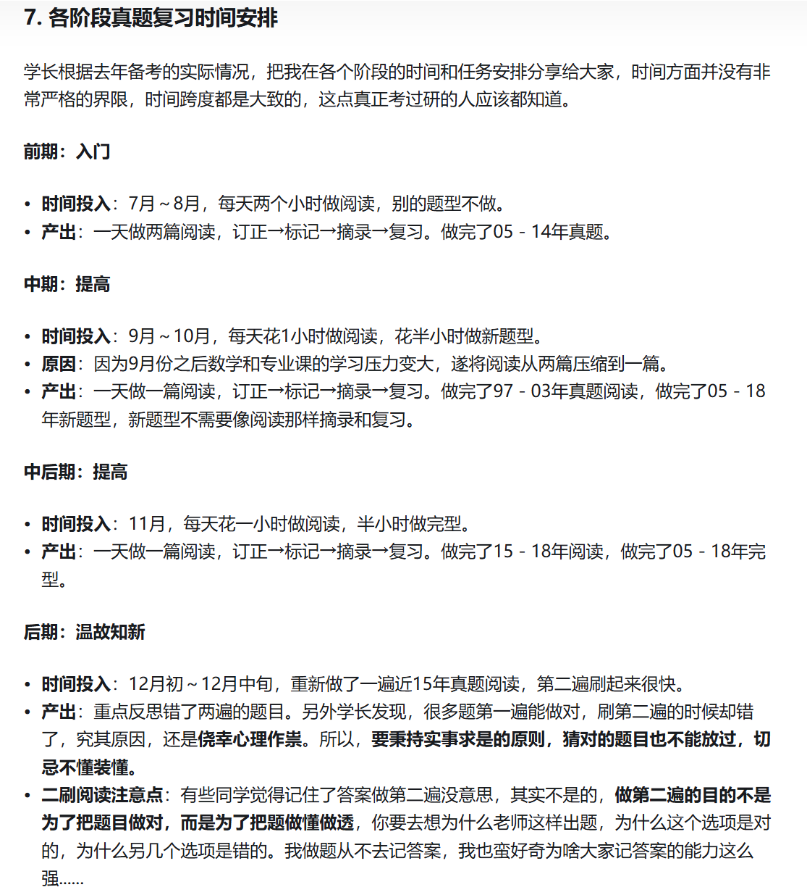

<!-- ## 习题册选择：黄皮书 单词：百词斩+摘录黄皮书文章（后期考察决定是否要买单词书）解析中的词组搭配和熟词生意 作文： 翻译：

各阶段真题复习安排参考

作文部分：

从考试大纲的要求来看，大作文的评分重点在于内容的完整性，文章的组织连贯性，语法结构和词汇的多样性以及语言的准确性。**因此对于内容我们不需要去追求新颖，只需要做到相关即可，能够自圆其说就行。**而结构上只需要合理分段就可以了。**我们的写作重心应该放在语言上。**因此可以得出这样的结论：**从重要程度上讲，考研大作文写作最重要的是语言，其次是结构，最后才是内容。**（《何凯文写作高分攻略》）
看完这段话我信心倍增，我坚信这个方向肯定是没有问题的，我的内容肯定是跟主题相关的，这点毫无疑问，接下去的任务就是中英文转换，毕竟不能把中文思路写到答题卷上吧，所以，明确思路之后，我**把重心放在了语言上，疯狂寻找优质的英文语料。**

**作文笔记**
**大方向指导**：先确定写作框架，再确定中文写作思路，最后摘录适合中文写作思路的英文语料。一份作文笔记就完成了。 -->

## 二、所用资料

(1)软件+纸质书:很简洁

单词:红宝书电子版+不背单词app

长难句:《句句真研》

真题:黄皮书+粉笔考研app

**作文:答题纸**

(2)网课:

**易熙人完型，刘琦新题型，唐静翻译，石雷鹏、周思成作文**

----

## 三、**时间安排**
单词从开始备考一直背到考前一天，每天早上30min-1h3月-5月:听《句句真研》网课+每天打卡长难句(公众号:田静老师)

5-6月:开始学习阅读，一周两篇阅读

6-9月:开始学完型+翻译，每天一篇阅读+一篇完型/翻译

9-10月:开始新题型+做对应真题

10-12月:开始学习、背诵作文+阅读二刷

**个人想法：**
          
          5月：一周四篇篇阅读，同时留2-3套整卷到最后检验
          
          6月-9月：学完型+翻译，每天一篇阅读+一篇完型/翻译
          
          9月-10月：开始新题型+做对应真题
          
          10月-12月：开始学习，背诵作文+阅读二刷

1.单词:基础
一战时我开始的比较早，12月开始用软件，每天20个单词，这样压力比较小英语底子不好的同学要早点开始背单词，打基础
英语底子较好的可以晚些，但是最迟也要在3月开始
要坚持背到考试前一天!!!
我到考前应该过了至少五轮单词，算上二战的应该是七轮了没有使用艾宾浩斯法，因为我觉得那样复习压力太大，容易后面厌学

第一轮:用不背app，不会的收藏到生词本

第二轮:用红宝书检验第一轮背诵成果红宝书每一单元开头都有一个导览速记!扫一眼，只要是我不会的单词我就会圈起来然后记在本子上

第三轮:复习记在本子上的生词

第四轮、第五轮:用不背app重新背，到第四轮我就基本上没有不会的单词了阅读读着也完全不吃力，做题很顺

## **个人倾向（单词）**

12月份买红宝书，直接进入上述第二轮中的导览速记部分，圈出不会的单词并记在本子上（包括一词多义中不熟悉的单词），这一部分可能2-3天（一天0.5h-1h）可以完成。

现阶段25/3/29（已将六级词汇过了三个星期，1000words/d）开始，35words/d将百词斩（26考研单词）中剩下的200词背完，并且在结束后以1000words/d的进度过三个星期。

上述结束后，开始用不背单词过红宝书的单词，并且持续到今年12月。

（缺少的部分个人认为对个人复习参考价值）

## **四、各题型学习计划+做题技巧**

2.阅读

(1)做题顺序:

**一轮用黄皮书纸质做题**

**二轮用粉笔考研app速读+做题(也可以淘宝买套便宜卷子做)**

(2)听课建议:
很多人会选择唐迟老师的课，但是我不喜欢听网课，所以我听了几节就没听了我觉得看个人选择，可以去试听一下再做选择还有!**长难句对阅读还有翻译也很重要!读不懂文章一切白搭要分得清主谓语定语状语，会拆解从句!**

(3)做题技巧:我会先标段落，然后去读题干!(注意:不读选项，因为浪费时间)根据题干的宾语去定位关键句，基本上某一个段落会对应一个选项，结合上文文章态度，进行排除，一般我会在决定答案的关键处做标记，方便后面检查

(4)碎碎念:**考研英语只需要做真题，一定要重视并利用好真题，阅读是最拉分的题型订正的时候要:1、记下不认识的词2、读不懂的句子去看黄皮书的解析，自己去拆解并翻译3、弄清楚自己选错的原因**

3.小三门

(1)**完型**
**推荐先试做，然后看易熙人老师的网课**。我认为完型比阅读还吃语感，想要一遍顺利做下来是不可能的，我一般第一遍会先读文章，了解大致意思，然后先把确定对的选项给填上，第二三四遍再去专注看拿不准的选项。对**于做的特别不好的年份，我会去看真题解析视频订正。提醒:10年以前的完型较难，错十几个是正常现象，不用慌，10年后正确率基本上就上来了!**

(2)**翻译**
**推荐唐静老师**
一般翻译我是留到考试最后再做
**之前提到的长难句对翻译很有帮助，学会拆解句子，看得懂单词就没什么问题**

(3)**新题型**
**推荐刘琦老师**
新题型分:**小标题，排序题，七选五**

**i.小标题难度弱些，找准段落想表达的主题+小标题的关键词**

**ii.排序我个人认为最难，核心是找逻辑关系词，如:however，although;或者:first,second这样表示时间顺序的**

**iii.七选五可以通过给出的两个选项进行前后选择**

4.**作文**

(1)**小作文:石雷鹏**
我是听了石妈妈的课，然后自己整理的写作模版(我专门开一篇帖子把图片加上)

(2)**大作文:石雷鹏+周思成**
**用的周思成的开头+石雷鹏的主体**
**大作文图画和图表都要听，今年的图画+图表结合应该难到了一批觉得不会考图表的人**
秘诀:**听课有大概思路+多背+多练，把字练漂亮点!**

## **五、补充**

1、**留2-3套试卷在12月开始模考，熟悉考试节奏，完全按正式考试检验自己**

2、**专业课永远是第一位的**，公共课是用来在专业课差不多的情况下拉开差距的英语太差的朋友一定不要有畏学心理，英语过不了国家线专业课再高也没用

3、我的网课是买书扫码进群存的没花钱，但是一战完就被我删了，二战我是纯背单词+做题，大家有条件的还是支持正版网课，没条件的咱们就wx搜一搜，很多公众号都有资源

4、**英语在 65-70分想提高的，注意提高完型和阅读的正确率，看看自己是哪种题型错的多些**

5、英语在 4.50分左右的，请好好背单词+学语法，可以多看英文电影电视剧培养语感，一口吃不了一个胖子