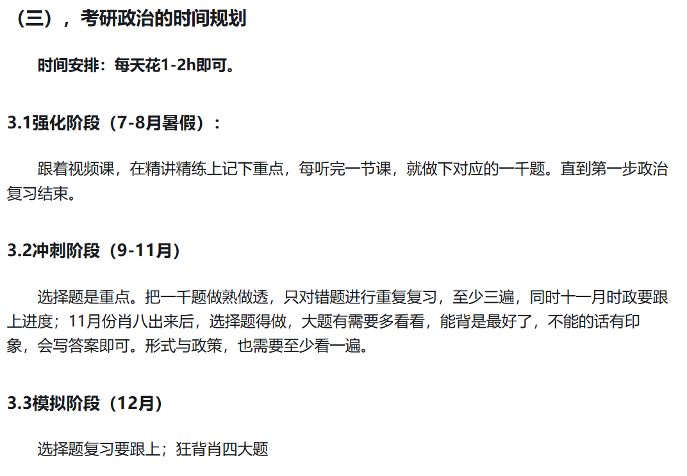
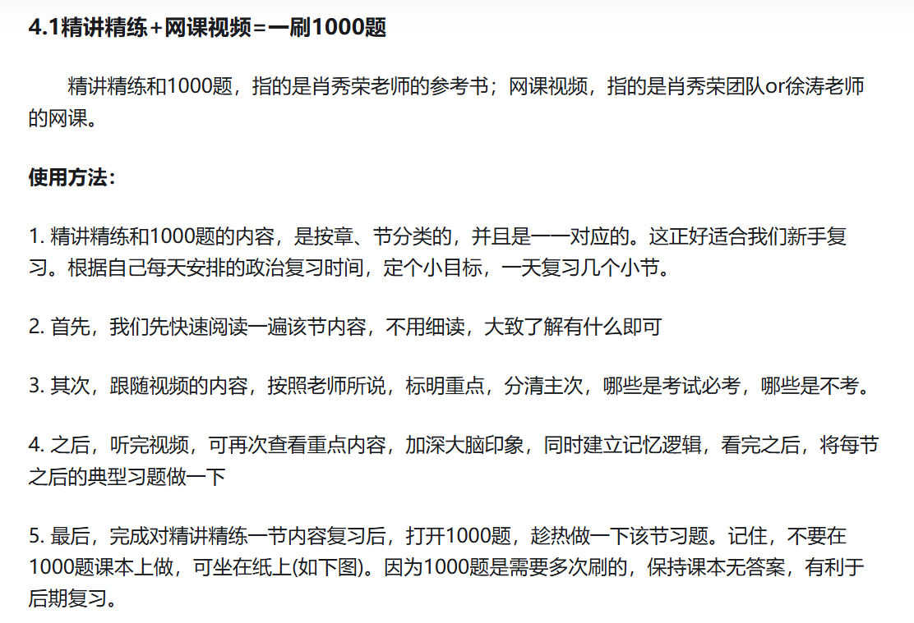
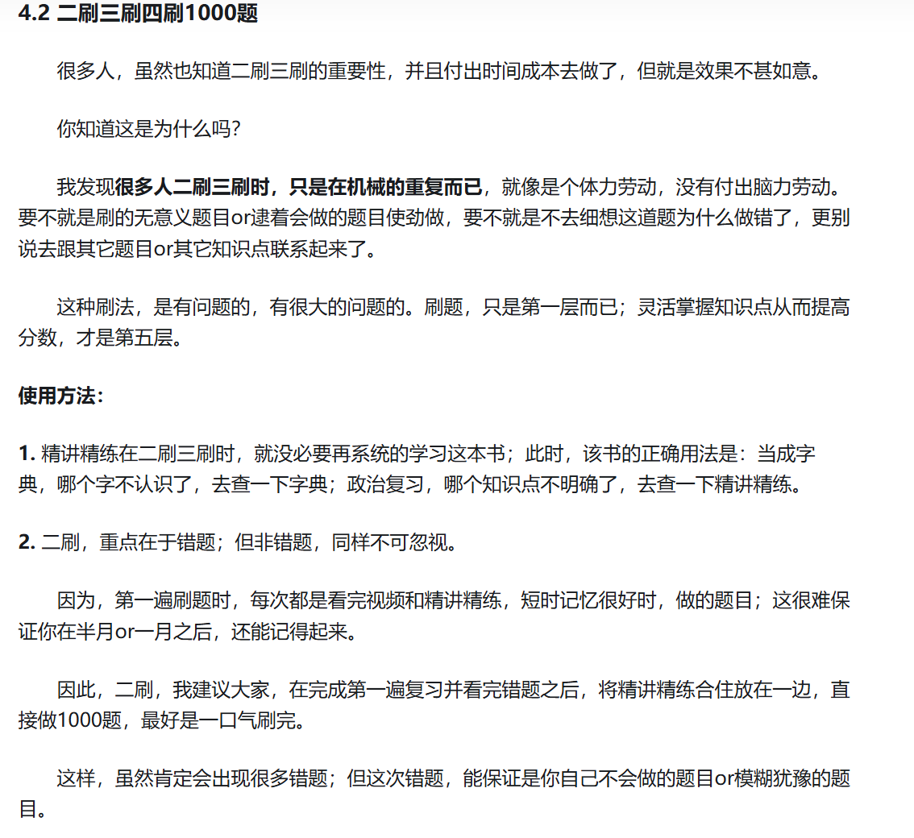
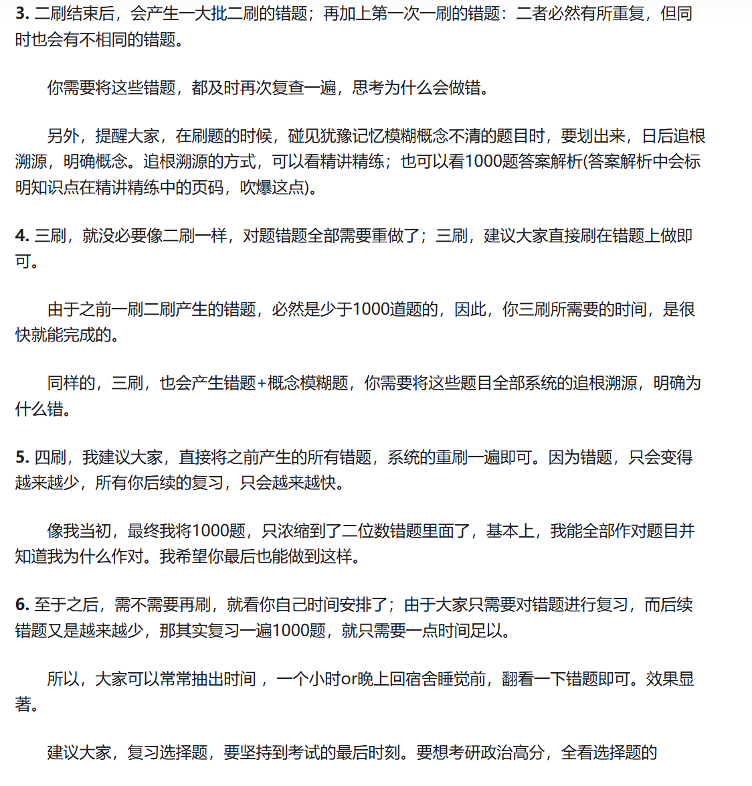
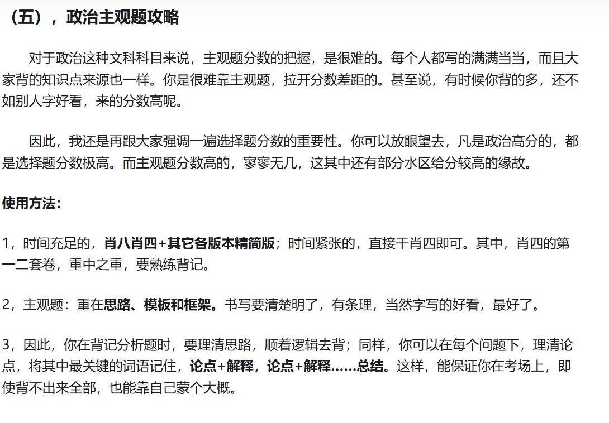
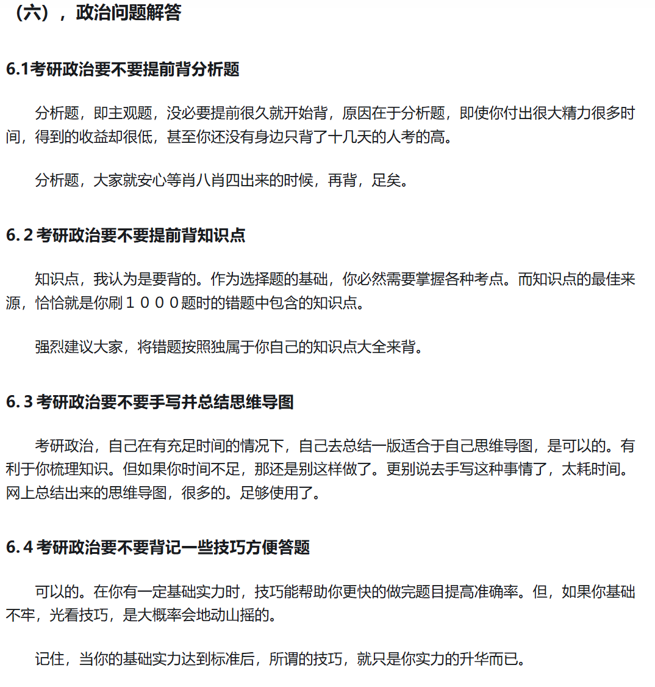

<!-- **政治推荐参考书**
**《精讲精练》**这本书，通常来说，都是与1000题搭配使用的。会产生1+1＞10的神奇效果。
使用精讲精练作为核心课本

**《1000题》及其《答案》**
该书是由肖秀荣老师编写而成的，前可搭配精讲精练共同使用，后可贯穿整个考研过程，内容有足足1000道题之多，涉及到了考研政治方方面面的知识点和易考点。

要想考研政治高分，其实像高数一样，也是个重在做题的过程。不断的重复做题，总结经验，政治的分数不会低的。

**《肖八肖四》**
肖八，主要用来做选择题；肖四，主要用来背主观题；主观题，主要背肖一肖二主观题，次要背肖三肖四两套卷。

虽然与其它主观题押题资料相比，肖四并不是内容最精炼的资料，但肖四，却是一个最适合你参加考试写满的资料。其扎实的物料和语言梳理，可以保证你即使在没碰到原题的基础上，也能蒙出满满当当的答案。

**政治时间规划**

**选择题攻略**

建议大家，在做完一章内容时，就及时对该内容做个前情回顾，复习错题；在做完一本书1000题时，由于前面内容做完后时间较长，可能遗忘了，因此需要对整本书的错题及时回顾。

**政治主观题攻略**

**政治问题解答**

**考研政治84分复习经验**
大家注意，要八十分左右的话总结一下：

**两遍精讲精练**（重点部分可以多来几遍，不重要的部分可以减少，重不重要看一千题的题目，可以辅助逻辑图进行梳理熟悉尤其是史纲部分）

**1000题细致的做完两至三遍，风中劲草一遍（已无）（风中劲草知识点梳理看两遍）+肖四肖八选择题两遍和简答题背熟**

还补充一个大家会问的**真题的用法**，如果我后期梳理了真题的框架和答题技巧可以对照着再去做真题，前期不需要做真题，大约十一月底的时候再去看真题，做两到三套真题的选择题，只做选择题！依据已经掌握的知识以及总结的技巧去做，是一个很好的检验你的做题技巧和方法的机会。平常做的一千题跟真题还是有一定差异，更侧重于基础部分。

**十二月份**就只看风中劲草去梳理，对重点内容进行记忆（风中劲草标注的重点），不需要再使用精讲精练了，然后就是**肖四肖八**。

然后啰嗦一句，**所有不知道方向的努力都是为了感动自己当炮灰，前期如果院校不确定，真题没研究，不必下狠心去复习，没用。**

**九月到十月中旬**：首先就是看精讲精练，相应的比较难理解的部分，例如马哲部分可以安排视频课，**看完每个章节就对应的做相应章节的1000题，将错误的题标记出来，并且不管是正确的题或者是错误的题都要对照答案看一遍，第二天将前一天错的题再复习一遍，**因为这些题最能直接体现出我们的知识薄弱点。可以对逻辑图和史纲时间轴。

**十月中旬到十一月中旬**：这一遍的事情自然就是巩固了，**具体的做法就是再看精讲精练和刷一千题，还是要对照答案，标注这一次还做错的题，但是这一阶段就多了一个任务就是除了要记得死答案还要思考做题的方法**，尤其是多选题，做题多了就会发现多选题其实有很多的选择的方法。这个后期更新答题技巧的时候讲吧。***此时可以对照逻辑图再梳理一遍，但要求对红色字体以及逻辑框架（尤其史纲）有大概印象。***

**十一月中旬到十二月**：这个过程还是**巩固**的时间，此时，大家可以购入另外一本书，就是风中劲草，风中劲草的第一页有关于不同部分的不同的复习方法，大家完全可以按照这个来，将知识点巩固再巩固，因为风中劲草不太多，**而且这个时间段也同时要巩固一千题，看自己做错的题和答案就可以了。**

然后就是十二月了：**十二月的开头**，大家还是可以看风中劲草和一千题，自己选择自己比较弱的地方去加强，然后就是肖四和肖八了，**肖四肖八的选择题最好是过三遍，**然后就是应用题，**应用题其实在真题原题出现的可能性有，但是不大，但是知识点是高度重复的**，很多人将肖四肖八和一千题背的滚瓜烂熟，甚至有很多人从六月份或者是三月份就开始复习，最后分数也不是特别高，就是因为没有掌握答题的技巧。所以对于简答题来说，如何应用是很重要的，**这就要求你在背诵的时候对知识点一定要理解**，理清楚答题的要点，**不要看它问了什么，看它回答了什么。**有很多同学会同时参考其他的资料，比如腿姐、徐涛、我个人觉得是不用，我自己也没用。肖四肖八背熟吃透完全可以应对考试。

----
我的建议是，1000题绝对是好东西，反复做，12月前连学带做刷两遍，错题再单独刷两遍，知识点掌握绝对就没问题了。但前面的基础学习，以及最重要的大题带背，还是跟着徐涛或者腿姐来吧。他们有自己的课以及带背，跟上他们的节奏最后一个月会很轻松，不至于最后两周一直在背肖四，上了考场发现要么背的是材料，要么背的没压中。 -->

# 使用资料
纸质版：

1.徐涛《核心考案》

2.肖秀荣《1000题》《肖四》《肖八》

3.腿姐《冲刺背诵手册》

电子版：

1.在刷题小程序二刷了肖一千，肖四，肖八，腿四，徐六（徐六没做完，就做了一套）。小程序->苍盾

2.在不易学长/小谭学长那里保存了肖四肖八选择题考点整理。

# 时间安排

## **第一阶段：七月中旬到八月底**
此阶段为打基础阶段，差不多是从暑假开始到暑假结束个人认为这个时间段是比较合适的。基础差的同学可以稍早点开始。如果暑假没有学完也不用紧张，九月中旬之前学完一轮也没问题。

🌸任务：**听徐涛强化班＋刷纸质版肖一千**

🌸注意事项:

○听课上：**1.5倍速看徐涛强化班，一节课时长约为1小时，平均每天看一节课。建议大家可以把听课时间放到晚饭后效率较低时，白天宝贵的时间留给英语和专业课**。徐涛老师讲课很有意思，可以放松心情哈哈哈

○刷题上：**不要被错误率打击到，大家错误率都相当高！肖一千在考察的知识点和出题风格上都和真题差距蛮大的。重点是要搞懂马原的知识点。可以看完一章刷一章题，加深一下听课印象。**

## **第二阶段：九月份到十月份**
此阶段为承上启下阶段，属于一轮打基础结束，在冲刺期来临前的巩固强化期。

🌸任务：
**九月份**的任务为**小程序二刷肖一千**，用**小程序刷题的好处就是做完一道题直接就能出现解析**，不用翻书了。
**十月份**的任务为**听腿姐技巧班＋背腿姐《冲刺背诵手册》上篇（主攻选择题）＋二刷肖一千完毕。**

🌸 注意事项：
去年腿姐似乎出现了一些争议，但是我认为都是一些对于考试成绩无伤大雅的事，而且我觉得听技巧班的过程也是巩固知识的过程，我个人还是很推荐的!**听课时建议跳过每堂课必备的10分钟闲聊阶段**，毕竟十月份时间也很紧张了……

## **第三阶段:十一月份**
任务:

**1.做肖八选择题(必)以及腿姐，徐涛老师的模拟题(选)**

**2.跟带背，背诵冲刺背诵手册下篇。**

注意事项:
模拟题每个同学都做，为什么效果却因人而异呢?我认为是因为做的复盘不一样!通俗来讲，就是做完题后进行的总结不同。

我认为**要想发挥模拟题的最大价值，就是要掌握每一个题的每一个选项**……我当时把每个选项知识点都背了两遍，一刷完八套题二刷基本都对了

另外，**在刷模拟题的过程中，我们可以重点再次阅读冲刺背诵手册上篇薄弱部分，以及刷肖一千相应部分。牢记，学习要根据自己的情况随时调整!**

## **第四阶段:十二月份**
任务:**肖四选择题+大题过两遍**
注意事项:

〇**再打印一份答案背**。书的字体太浅，而且空隙有限。**我当时是找了pdf把四套题的大题答案额外打印了一份一套题大概三四页，比直接拿着书背舒服多了，强推!**

〇**注意答题逻辑**。我一般**先通读遍整道题的答案，根据意思进行一些标记分段后再背。**

〇**反复背诵**。**第一遍用时10天左右，第二遍用时4天(一天一套)，最后，在考前那天晚上和第二天临考前再迅速把四套题过一遍!**
总之，**就是要把背的东西迅速调动一遍，不能白背!**
最后的最后，**即使不会答，也要往多了编，争取写满整个答题的区域**