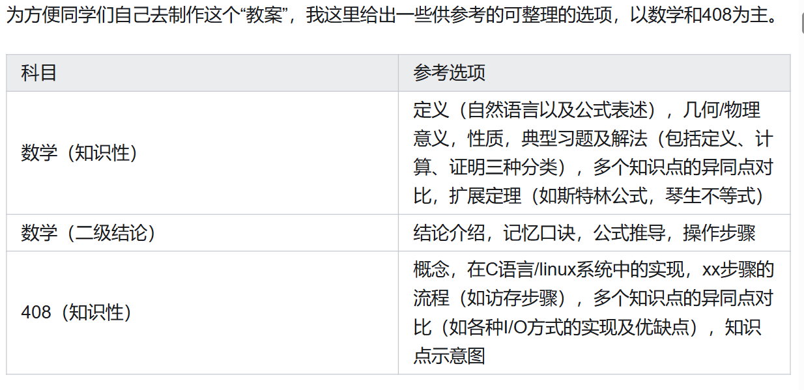

## **问题导向 阶段检验** From 知乎：必须里G1咯

什么是问题导向？我们备考的目的是考个高分嘛，比如你的目标是12月25、26号的考试中考到380分或者400分或者420分或者440分…… 问题就是你现在去考280分都够呛。为了解决这个问题，所以得学习。又比如你背了两个月单词，但是不知道自己啥水平，不知道是应该接着只背单词还是要着手准备做阅读真题了，那你就得找到自己的问题，自己判断。最好的找问题的办法就是看真题，你拿一篇真题的阅读看一看，如果发现自己读不懂句子很多是因为单词不认识，那就赶紧加强背单词，顺便反思自己是不是背单词的方法有问题，时间花了很多，效果却不好。

数学和408也是一样，你可以在搞完数学一轮的时候做一张真题，限时3小时，看看自己能考几分，这张卷子就能暴露出非常多问题，指导你二轮的时候去努力解决问题。如果你学习的时候不是问题导向，就很容易混日子水时长。我观察到有的同学二轮复习408的时候，就在那看王道书，一行一行看下来，笔都不动，书上干干净净，笔记本也没有，好像是在看小说一样。看了一个上午感觉时间很长，实际上没怎么过脑子，因为他的学习不是问题导向的。你发现自己没有掌握一个知识点想去搞懂、发现自己遗忘了一个知识点去复习的效率，与漫无目的地翻书的学习效率是相差很多倍的。

主打一个面向真题备考，学太多超纲知识是没有用的，你要阶段性地评估自己与考研真题之间的差距。建议刚开始备考就买好真题。

学习的目的是解决疑问，学到东西，如果你觉得11408你都懂完了，开摆打游戏也不是不可以。

## **高效学习8小时**

学习时间的话我是平均每天8小时，偶尔也休息一天。基本的学习时间必须保证，比如你让我7月8月开始备考，我基本上很难上400分，但是多给我两个月时间备考（比如把考试时间推迟到2月25日），我也不会多考几分。所以保证一个基本时间就好，多了无聊浪费，当然少了就寄了。我觉得跨考比科班多2个月时间，数学基础差的（比如文科）比数学基础好的多两个月时间，这样基本足够了。然后每天也不必要追求时长，比如十几个小时，时长不解决任何问题，学到东西提高分数才解决问题。

影响学习效率的因素，很多人是因为电子产品，去自习的时候可以远离电子产品，自己把握嗷。假学习骗得了别人，甚至骗得了自己，但是骗不了分数嗷。

## 方法论部分 From 知乎：北海

方法论部分考试考察的是什么能力？要搞清楚这个问题，我们首先要明确考试的定义。我认为**考试是一种在限定时间内考察考生对知识掌握程度的活动**。在这个定义下，考试成绩反映的是人两方面的能力：一是知识掌握运用的能力，即**学习能力**；二是**限定时间内、一定压力下**出色完成任务的能力，在笔试这种形式下即**应试能力**。

学习能力与智力、学习方法、专注力等多方面因素有关，而应试能力和专注力、心态、调整能力息息相关。对于任何一名要参加笔试的考生，他都不能只提升自己某一方面的能力而忽视提升另一方面的能力，否则便会导致事倍功半的结果。

学习能力的训练上，我这里给出两种策略/方法——**任务驱动策略**和**单人费曼学习法**；应试能力的训练上，我这里给出我认为重要的**应试基础**，以及提供一种方法——**压力训练法**。

## 任务驱动策略

如果你经常浏览考研的信息，那你一定会见到很多这样的问题：三月份/四月份/五月份/... 才开始准备考研，是不是考不上了？事实上，在看考研上岸的经验贴时，你会发现有准备三个月上岸985的，也有六个月上岸北大的，还有一年多备考最后初试前几的，同样也有准备了两年最后没有考好的......其实他们说的都没有问题，问题在于：**决定备考质量的是否是备考的时间**？

显然不是的，我们说了，考试考察的重要能力之一是知识掌握运用的能力，而并不是考察谁坚持的更久。所以我在这里想强调一个重要的观念，即**践行任务驱动学习法，而不是时间驱动学习法**。

也就是说，**如果今天要完成的任务完成了，那剩余的时间大可以放轻松地去玩；如果今天的任务还没有完成，那就专注于把它完成，而不用斤斤计较于今天学了多久**。只有这样，才能让我们**从毫无意义的时间焦虑中脱离出来，真正集中于我们应该做的事情**。举个例子，我自己在今年十一月份的时候平均一天学习4~5个小时，其余时间拿来玩手机、打游戏和看电影什么的，我也并没有感觉焦虑，因为我知道我该完成的任务已经完成了，其余的时间我可以拿来休息，就是这个道理。

那么我们应该怎么实践这个方法呢？我这里提供一个可参考的方法，以北大信工为例：

## 1、**首先，找到你目标学校近三年内的考研复试名单，得到复试线与平均分**。

这个数据可以去**目标学院的研究生招生网官网信息**公开部分找到，也可以关注公众号 研考数据整理分析 ，上面会有部分学校的录取信息。

## 2、**根据三年内的趋势，预估今年的大致分数线**。

信工在2020年是自命题，可以认为其分数 + 10分 = 408分数。202020212022复试线334374350平均分3603953742020年北大各个学院还未改考408，所以参考时权重放低一点。那么可以认为北大信工23年的复试分数线大概率在350 ~ 370之间，平均分在370 ~ 390之间。这种估计方式有它的局限性，对于招生人数较多的学院较为准确，对于招生人数较少的学院（个位数或者十几名）则参考意义有限，如果要报考这类学院的同学建议按历年最高分准备，且招生人数较少的学院建议参考录取平均分而不是进入复试的平均分。

## 3、**根据平均分和自身情况确定初试目标**。

这里的自身情况指自己对不同科目的擅长情况以及自己的心态情况。以我为例，23年报考北大信工的平均分估计为370 ~ 390，再加上我心态不好，所以目标应该适当定高一点，我给自己的目标定为390 ~ 400分。以总分400分作为目标，各科目标为政治70分，英语70分，数学135分，408 125分。

对于自己心态情况的判断我建议客观参考自己过往的大型考试情况。如果你在过往的大型考试中（如高考、第一次考研）**至少有一次取得过比平时考试平均水平低20分以上的成绩（**标准不唯一），那么你就可以认为自己心态较差，在准备考研的时候也要认为**你仍会出现发挥失常**的情况。因此，你的目标要比平均分高10 ~ 20分。如果自己过往大型考试中没有此类发挥失常的情况，那可将目标定为平均分即可。

## 4、**根据目标制定阶段规划、月度规划与周度规划——你是你自己的项目经理**

一般来说，对于考研来讲，你应该**在11月底之前拥有达到你目标的水平**，**即至少留出一个月时间来稳定你的成绩**。
**据此我们可以确定每个阶段（基础，强化、冲刺），每个月（如从3月到12月）的规划**。

做出月规划后，根据月规划确定好这一月每周需要完成的任务是什么，并自己设计好检验任务完成程度的方式，方式可以自己确定，我这里给出几种参考示例：

（1）这周学习了不定积分和定积分两个部分的内容，我就可以用《880》**习题册的正确率**进行验证。抽出一天或两天的时间，在不看答案的情况下做《880》这两章节的习题，最后对答案。880的强化篇算上各种错误（计算错误、不会、看错等等）的正确率如果在80%以上，一般认为可以达到130分在强化阶段的训练标准。

（2）这周学习了408中的I/O部分。**我可以抽出一个下午的时间，拿出一张大白纸，去对这周学习到的内容做总结**，因为这个内容在计组和操作系统中都有涉及，所以可以自己尝试对比这一章内容在不同学科分类中的异同点。（详细方法见下文）

（3）这周属于冲刺阶段，主要进行**模拟卷演练**。以两天做一张模拟卷为例，这周一般会做3 ~ 4张试卷，我可以对这些试卷进行分析：平均分怎么样？错误的部分属于哪个章节的内容？错误的原因是什么？等等。**一般来说，最后考研的那张卷子的难度在李六和李四之间，简单年份难度与李四差不多，困难年份难度与李六差不多**。所以李林模拟卷的平均分接近于你最后的考试分数。但如果是心态较差的同学，最后的考试分数会低于李林模拟卷的平均分0 ~ 30分不等。所以建议按照自身情况判断模拟卷练习是否达标。

**根据这周任务的完成情况，动态调整下周任务量**。即如果这周任务完成的不错，那下周任务按原计划进行或者加快进度；如果这周任务完成的欠佳，那将这周的部分任务在下周时再做一做。

有人说，考研就像是在关灯的房间洗衣服一般，只有结束的那天你才知道自己洗的有多干净。但我想，通过这种任务驱动的方式，会让你清楚地了解自己的复习情况，既可以避免时间焦虑，又可以游刃有余地调控自己。

## 单人费曼学习法

费曼学习法认为：**对一个知识而言最好的学习方法就是把它教给别人**，我深以为然。很多时候你自认为已经掌握的知识、方法，其实并没有完全掌握。具体表现就是：你会发现在你给其他人讲这个知识点的时候，你并不能很好地把这个知识点表述出来让别人听懂，甚至你讲到一半自己也不知道自己说的对不对了。而一旦你能够把一个知识点、一道题目简洁地、顺畅地讲给别人，那就证明了你真的理解了这个知识点。

但我们在考研的时候不一定有条件将自己学到的所有东西统统给朋友讲一遍，这时我给大家的建议就是采用单人版的费曼学习法。

**具体方法就是：拿出一张大白纸，想象你是一名备课老师，在可以翻书的情况下，将一整个章节的重点难点用你自己感到舒服的形式（如思维导图、口诀等等）写到纸上。你要时刻提醒自己，你要给一群不了解这些知识的学生讲课，这张白纸就是你的教案，你要尽可能避免不清楚的表述，尽量采用多个角度去阐述你写的东西**。

这个教案的形式不重要，**重要的是内容是否足够能让初学者也get到这一章的重点难点，能掌握一些高维的理解方式（如几何意义、物理意义）**。

当然，你也可以把自己想象为一个**教材的编撰者**，力求自己的语言严谨而又不失易读性。比如你在写自己发现的一些二级结论的时候，可以适当地编一些口诀。

其实这套方法与在知乎上写分享，乃至发表科研论文都是异曲同工的。都是要用简洁、严谨的语言将自己的想法表达出来，力求让对你所在领域了解不多的人也能很容易看懂你写的东西。

## 应试基础-如何提升自己的应试能力？

那么，我是如何提升自己的应试能力的呢？

大部分人大型考试的成绩不如平时练习的原因都可以归结为两个方面——**1、写题速度慢；2、低级失误多**。

所以我们要针对性地给出建议。

**1、写题速度慢**。写题速度慢一般又可以细分为两个原因——**（1）算得慢**；**（2）想得慢**。

（1）算得慢算的慢的原因有很多很多。但大体上可以归结为**初等数学的原因和高等数学的原因**。

这里我所说的初等数学的原因即是指对于**开方、乘方、两位数乘法、三位数乘法的计算速度**不够以及对于**初等数学中的常见公式的掌握程度不够**。

我建议每个同学都背熟1 ~ 25的平方数、1 ~ 10的立方数，并能在2秒钟（最好是1秒）之内反应得到正确的答案。而对于任意两位数、三位数之间的乘法，我建议大家两位数在20秒（最好是10秒）以内，三位数在30秒（最好是20秒）以内能够笔算得到正确结果。这两点是计算能力的基石，如果你能做到这个，你的计算速度和准确度都会上一个台阶。

如果二位数、三位数乘法没有达到要求的话，我建议大家可以**找一本小学或初中专门用于练习这方面能力的练习册**，好好地练一练，不用怕丢人。把一本练习册做完最多需要半个月的时间，但对做题速度准确度的提升是质变的。

而对于初等数学中的常见公式（如平方差公式、二项展开式）的掌握程度不够的话，我建议可以**买一本《张宇基础30讲》**，**在这本书的开头章节详细地罗列了初等数学中的几乎所有公式**。平时写题的时候可以多翻看，甚至可以把这一章都背住，会对你的解题大有裨益。

高等数学的原因基本可以归结为**三大计算（求极限、求导数、求积分）**的能力不足，我建议可以买一本**杨超老师的《三大计算》**，掌握这上面的所有题目。这样基本就不会在常见的三大计算类问题上再出现错误。

2）想得慢

想得慢是指看到一道题目不能很快地反应出解题思路，或者是正确思路，即总是先尝试了很多错误思路才找到正确的思路，这无疑很浪费时间。解决这一类问题的方法基本可以归结为——**多做题**。但我们做题也不是盲目地去做题，要配合上上文所说的单人费曼学习法**边做边总结**，把一些**经典的题目刻在脑海里**，这样就可以提高我们思考的速度。

同时，也要多多积累一些**二级结论**和**二级结论的推导方式**，这样也有利于你看出题目中所需要的思路。

